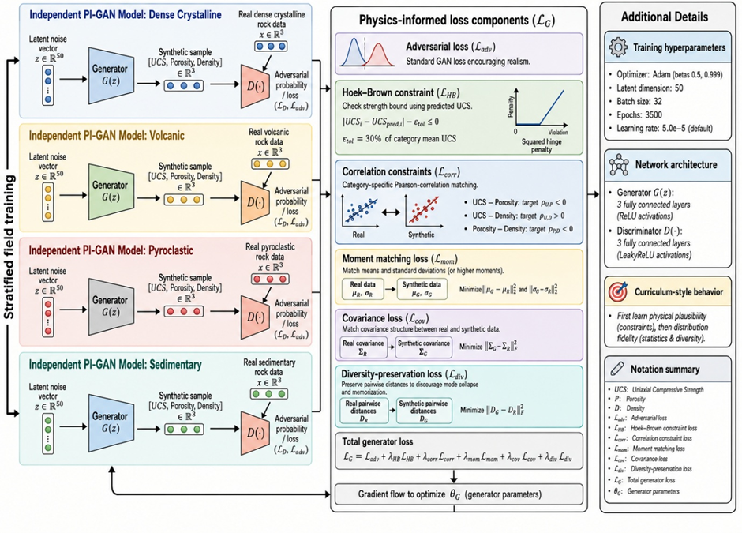

# PI-GAN Rock Mechanics

Diversity-tuned physics-informed generative adversarial network (PI-GAN) for synthetic uniaxial compressive strength (UCS), porosity, and dry-density data generation in multi-rock mechanics.

This repository supports the revised manuscript:

**Physics-informed generative adversarial networks for synthetic uniaxial compressive strength data generation in multi-rock mechanics**

## Figure 6. Diversity-tuned PI-GAN architecture



## What this code does

The implementation trains category-specific PI-GAN models for four rock categories:

- Dense crystalline
- Volcanic
- Pyroclastic
- Sedimentary

Each category-specific model generates synthetic tabular rock-property samples:

```text
[UCS (MPa), Porosity (%), Dry density (kg/m3)]
```

The generator objective combines:

- adversarial loss
- intact-rock strength-envelope constraint
- UCS–porosity correlation loss
- UCS–density correlation loss
- porosity–density correlation loss
- feature-envelope penalty
- moment matching
- covariance matching
- pairwise-distance diversity loss

The validation workflow includes:

- Kolmogorov–Smirnov tests
- Fisher z-tests for correlation preservation
- maximum mean discrepancy (MMD)
- pairwise-distance diversity ratio
- nearest-neighbor memorization ratio
- near-duplicate-rate analysis
- manuscript-ready figure generation

## Repository structure

```text
pi-gan-rockmechanics/
├── pigan_rockmechanics.py
├── requirements.txt
├── README.md
├── .gitignore
├── figures/
│   └── figure6_pigan_architecture.png
└── outputs/
```

## Installation

Create a clean Python environment:

```bash
python -m venv .venv
source .venv/bin/activate        # Linux/macOS
# .venv\Scripts\activate         # Windows

pip install -r requirements.txt
```

For GPU training, install the PyTorch version matching your CUDA environment from the official PyTorch installation page.

## Input data

The script accepts `.xlsx`, `.xls`, or `.csv` files. For the P³-style Excel workbook, the code automatically maps common column names including:

| Required variable | Accepted examples |
|---|---|
| UCS | `σc`, `ucs`, `ucs_mpa`, `uniaxial_compressive_strength` |
| Porosity | `n`, `porosity`, `porosity_pct` |
| Dry density | `ρd`, `rho_d`, `dry_density`, `density`, `density_kgm3` |
| Rock type/class | `Rock Type`, `Rock Class`, `lithology` |

The real dataset used in the manuscript is sourced from the publicly available P³ PetroPhysical Property Database:

Bär, K., Reinsch, T., Bott, J., 2020. The PetroPhysical Property Database (P³) – a global compilation of lab-measured rock properties. *Earth System Science Data*, 12, 2485–2515. https://doi.org/10.5194/essd-12-2485-2020

## Quick smoke test

Run a short test first:

```bash
python pigan_rockmechanics.py \
  --data ROCK_sc_10.xlsx \
  --sheet-name "Database 4025" \
  --epochs 50 \
  --batch-size 32 \
  --make-figures \
  --output-dir outputs/smoke_test
```

## Full manuscript run

```bash
python pigan_rockmechanics.py \
  --data ROCK_sc_10.xlsx \
  --sheet-name "Database 4025" \
  --epochs 3500 \
  --batch-size 32 \
  --latent-dim 100 \
  --seed 42 \
  --device auto \
  --make-figures \
  --output-dir outputs/final_run
```

## Expected outputs

The script writes tables to:

```text
outputs/final_run/tables/
```

Key files:

```text
real_clean_mapped_data.csv
synthetic_pigan_diversity_tuned.csv
training_log_diversity_tuned.csv
validation_metrics_diversity_tuned.csv
correlation_preservation_diversity_tuned.csv
reviewer_summary_metrics_diversity_tuned.csv
training_metadata.json
```

Figures are written to:

```text
outputs/final_run/figures/
```

## Reproducibility notes

- The default random seed is `42`.
- The manuscript configuration uses `epochs = 3500`, `batch_size = 32`, and `latent_dim = 100`.
- The model trains separate generator/discriminator pairs for each rock category.
- Synthetic sample count is matched to the number of real samples within each rock category.

## Code availability statement

The PI-GAN training code, preprocessing scripts, validation scripts, and figure-generation workflow are available in this repository:

```text
https://github.com/kilickursat/pi-gan-rockmechanics
```

## License

MIT License for open research code.
